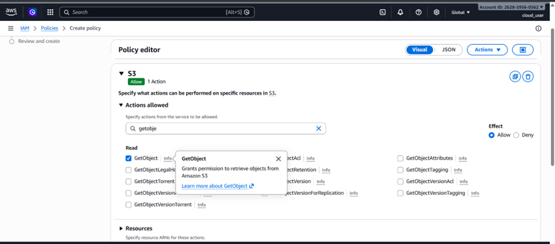
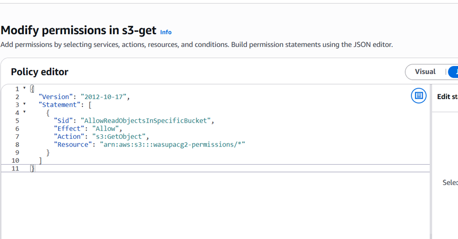
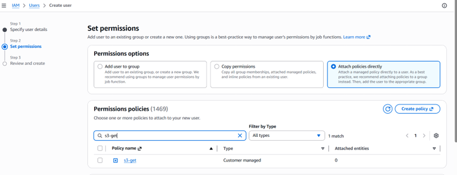
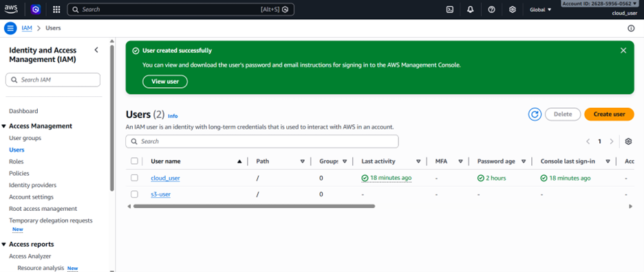
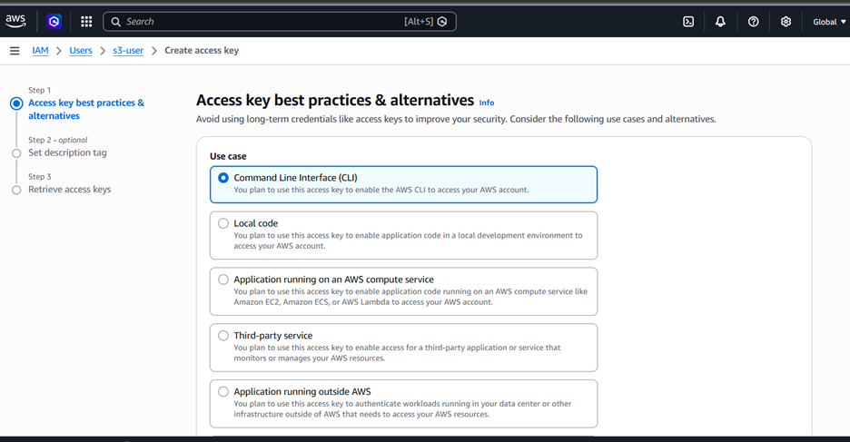
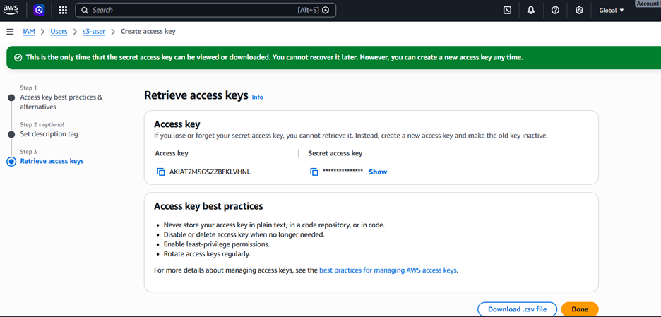
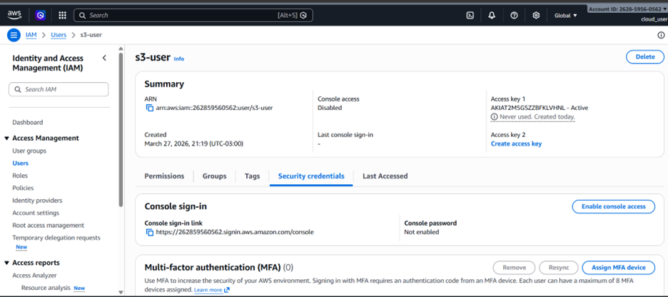
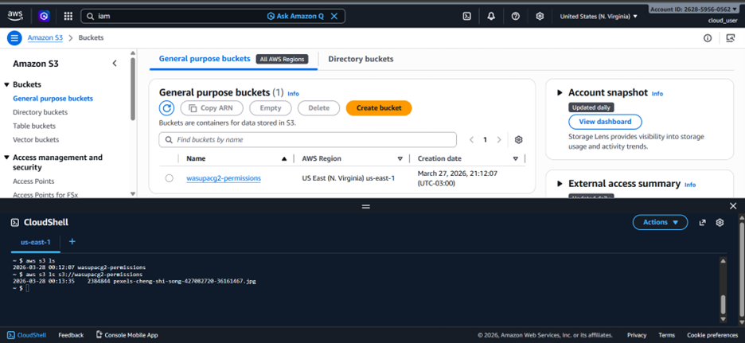
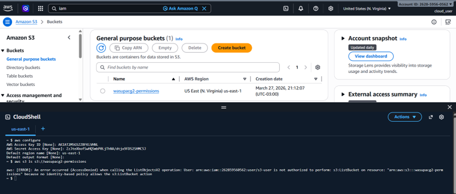
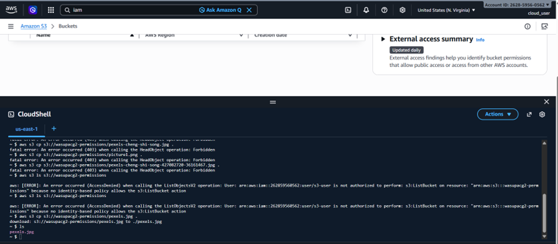

# AWS IAM Policy for S3 Access Control

> A hands-on demonstratinon on how to enforce least-privilege access to Amazon S3 using IAM policies and validate permissions using AWS CLI.

---

## Overview

This project focuses on implementing **fine-grained access control** for Amazon S3 using IAM.

Steps as follows:

- Create an S3 bucket  
- Upload an object  
- Define a custom IAM policy  
- Restrict access to only `GetObject`  
- Validate permissions using AWS CLI  

---

## Architecture
IAM User → IAM Policy (GetObject only) → S3 Bucket
↓
AWS CLI Access

---

## Objectives

- Understand IAM policy structure  
- Apply least privilege access principles  
- Restrict S3 actions to specific operations  
- Test permissions using AWS CLI  
- Identify allowed vs denied actions  

---

## Technologies Used

- Amazon S3  
- AWS IAM  
- AWS CloudShell / CLI  

---

## Implementation Steps (With Screenshots)

### 1. Create IAM Policy (GetObject)

---

### 2. Define Policy JSON

---

### 3. Attach Policy to IAM User

---

### 4. Verify User Creation

---

### 5. Generate Access Keys

---

### 6. Retrieve Access Keys

---

### 7. Review IAM User Details

---

### 8. Verify Bucket and CLI Interaction

---

### 9. Access S3 via CLI (Initial Attempt)

---

### 10. Test Permissions (Failure + Success)

---

## Results

- User cannot list buckets (`AccessDenied`)  
- User can download objects using `GetObject`  
- Least privilege successfully enforced  

---

## Key Insights

- **Least Privilege is Critical**  
  Granting only `s3:GetObject` ensured the user could download files but not view or enumerate resources.
- **AWS Uses a Deny-by-Default Model**  
  Any action not explicitly allowed is automatically denied, reinforcing strong security by design.
- **Fine-Grained Permissions Matter**  
  Even closely related actions like `GetObject` and `ListBucket` are completely separate and must be defined individually.
- **Testing Validates Security Design**  
  Using the AWS CLI helped confirm exactly what the user could and could not do in a real-world scenario.
- **IAM Policies Require Precision**  
  Small mistakes in actions or resource scope can lead to either broken access or over-permissioning.

---

## Lessons Learned

- **`s3:GetObject` does NOT allow listing objects**  
  You must explicitly include `s3:ListBucket` if listing is required.
- **Resource Scope is Just as Important as Actions**  
  Defining the correct bucket or object ARN is crucial for policy effectiveness.
- Testing permissions is essential to verify security design  
- IAM misconfigurations can easily lead to over-permissioning  

---

## Challenges Encountered

- Understanding difference between:
  - `GetObject`
  - `ListBucket`
- Correctly scoping resources in IAM policy  
- CLI credential configuration  
- Interpreting AWS permission errors  

---

## Recommendations

### Security

- Always follow **least privilege principle**  
- Avoid using wildcard (`*`) in production policies  

### Improvements

- Add `ListBucket` selectively if needed  
- Restrict access to:
  - Specific objects
  - Specific prefixes  

### Testing

- Use IAM Policy Simulator  
- Test with multiple users and roles  

### Production Use

- Use **IAM Roles instead of users**  
- Rotate access keys regularly  
- Enable logging with:
  - CloudTrail  
  - S3 access logs  

---

## Conclusion

This lab demonstrates how to enforce **secure, minimal access controls** in AWS using IAM policies.

It highlights:

- The importance of least privilege  
- How AWS enforces permissions strictly  
- The value of testing access via CLI  

---

## Project Structure
├── README.md
└── screenshots/

